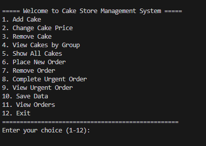
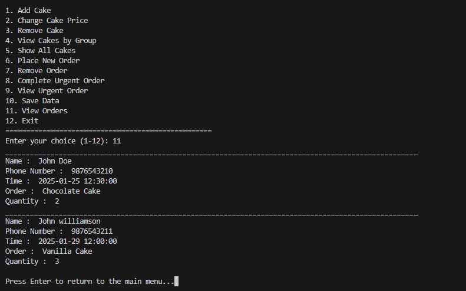
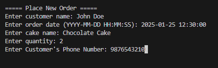
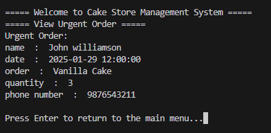
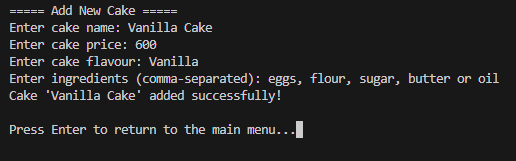
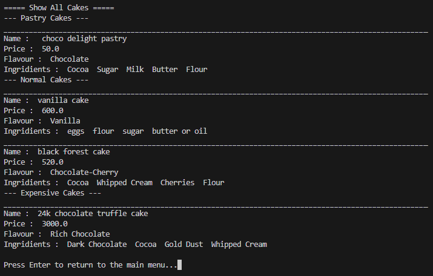
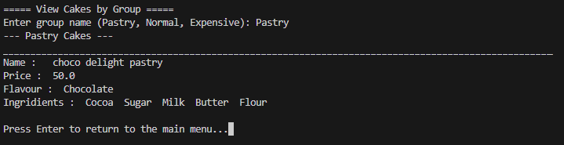
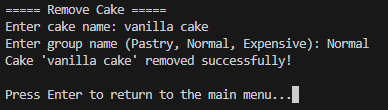

# Cake Store Management System

## 🎂 Project Overview
The Cake Store Management System is a CUI application that would take the responsibility of efficient cake orders, customer details, and inventory management. It integrates some of the advanced concepts in DSA along with Python's pickle for data persistence, which makes the project a user-friendly application.

## 🚀 Features
- **Customer Management:**
  - Create new customers with their orders.
  - Cancel orders based on phone numbers.
  - Print urgent orders sorted by their timestamp.
  - Display all pending orders.
- **Cake Inventory Management:**
  - Add and organize cakes into categories.
  - Manage different kinds of cakes at once.
- **Order Management:**
  - Set completed status for the orders.
  - Maintain order history.
- **Persistent Data Storage:**
  - Using pickle for efficient storing and retrieving data.
  
## 🔧 Technologies Used
- **Programming Language:** Python
- **Data Persistence:** `pickle`
- **Concepts:** DSA (Sorting, Queue Management, Binary Search Tree, Persistent Storage)

## 🗂 Project Structure
```
Cake_Store/
├── Customers.py             # Handles customer data and operations
├── Store_Management.py      # Core store management logic
├── Main.py                  # Entry point for the system
├── Cake_Data/               # Directory for persistent data storage
│   ├── Customer_Data.pkl    # Customer data storage file
│   └── Cake_Data.pkl        # Cake data storage file
├── README.md                # Project documentation
└──Screenshots
```

## ⚙️ Instructions to Run
1. **Clone the Repository:**
   ```bash
   git clone https://github.com/Rikan-M/Python-DSA-Projects.git
   cd Cake-Store-Management
   ```

2. **Run the Application:**
   ```bash
   python Main.py
   ```

3. **Sample Usage:**
   - Follow the prompts on the screen to enter orders, manage customers, and see order details.

## 📋 Sample Data (Optional)
Here are some examples for test cases for you:
1. Add a customer:
   - Name: John Doe
   - Date: `2025-01-25 12:30:00`
   - Order: Chocolate Cake
   - Quantity: 2
   - Phone Number: `9876543210`
2. View pending orders after multiple entries.

## 📝 Project Highlights
- **DSA Integration:** Sorting customer orders by timestamps.
- **Persistent Data Storage:** Securely handles customer and inventory data.
- **Error Handling:** Robust exception handling during data storage.

## 📷 Screenshots










## 🔑 License
This project is licensed under the MIT License.

## 🌍 Connect
- GitHub: https://github.com/Rikan-M

---

